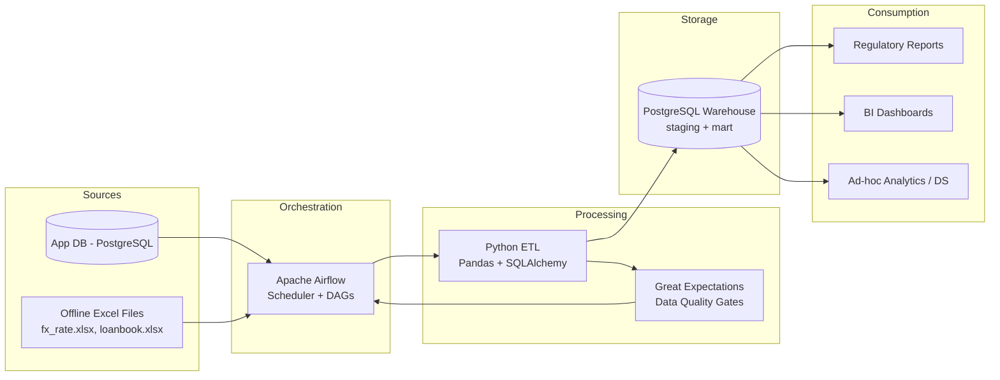
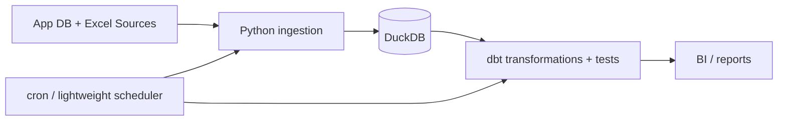

# Assessment 1 - High-Level Architecture Design
## Objective
Design a robust, cost-effective, and maintainable architecture for a fintech data platform that serves:
- Regulatory reporting (daily/monthly)
- Internal BI and monitoring
- Ad-hoc analytics and model development

Given constraints:
- Small data team (3-4 people)
- Prefer established tools for continuity
- Use local/open-source stack

## Option A (Selected): Postgres + Airflow + Python ETL + Great Expectations
### Diagram

### Pros
1. **Operational simplicity for small team**: one orchestrator + one database pattern.
2. **Strong maintainability**: Airflow and Postgres are mature and widely known.
3. **Clear observability**: task-level logs, retries, and scheduling in Airflow UI.
4. **Easy local reproducibility**: full stack runs with Docker Compose.

### Cons
1. More components than minimal stack (scheduler + DB + code image).
2. Airflow has learning curve for teams new to orchestration.
3. Requires basic container operations discipline.

## Option B: DuckDB + dbt + Lightweight Scheduler
### Diagram

### Pros
1. Lightweight and fast local analytics.
2. Lower infra footprint.
3. Good for solo/small experimentation.

### Cons
1. Less aligned with explicit Airflow scheduling requirement.
2. Weaker demonstration of orchestrator-grade operations.
3. Can be less familiar to teams standardized on Postgres/Airflow.

## Why Option A Is Chosen
Option A best fits the assignment constraints and expected production-like behavior:
- established toolchain,
- easier onboarding for mixed DE/DS/BI team,
- explicit support for both periodic and ad-hoc workloads,
- reliable quality gates before serving downstream users.
